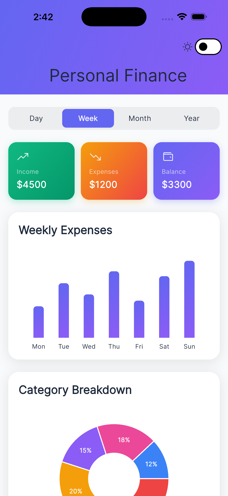
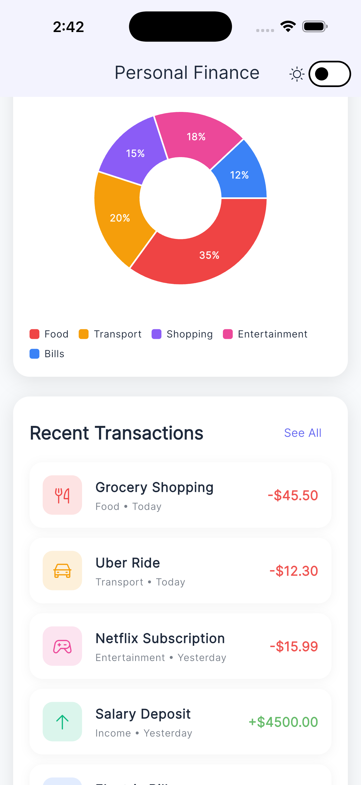

# Personal Finance Visualizer 💰

A premium Flutter application showcasing advanced UI/UX capabilities with beautiful animations, data visualization, and modern design patterns.

## ✨ Features

### Visual Design
- **Premium Color Palette**: Curated HSL-based colors with vibrant gradients
- **Glassmorphism Effects**: Modern frosted glass aesthetic on cards
- **Gradient Cards**: Multi-color gradients for visual depth
- **Custom Shadows**: Multi-layered shadows for elevation
- **Dark/Light Mode**: Smooth theme switching with custom palettes

### Animations
- **Animated Counters**: Numbers smoothly count up on load
- **Staggered Animations**: Cards and elements fade/slide in sequentially
- **Chart Animations**: Bars grow from zero with smooth curves
- **Micro-interactions**: Scale and fade effects on card appearance
- **Pull-to-Refresh**: Custom refresh indicator

### Data Visualization
- **Bar Chart**: Weekly expenses with gradient fills and touch interactions
- **Pie Chart**: Category breakdown with interactive sections
- **Custom Tooltips**: Beautiful hover states with contextual information
- **Time Period Selector**: Smooth animated selector for Day/Week/Month/Year

### UI Components
- **Gradient Summary Cards**: Income, Expenses, Balance with animated counters
- **Transaction Cards**: Beautiful cards with category icons and colors
- **Category Pills**: Colorful category indicators
- **Skeleton Loading**: Shimmer effect during data loading
- **Custom App Bar**: Gradient app bar with theme toggle

## 🛠 Tech Stack

- **Framework**: Flutter 3.35.7
- **State Management**: Riverpod (with code generation)
- **Charts**: FL Chart
- **Typography**: Google Fonts (Inter)
- **Icons**: Phosphor Icons
- **Routing**: GoRouter
- **Loading States**: Shimmer

## 📱 Running the App

```bash
# Install dependencies
flutter pub get

# Generate code
dart run build_runner build

# Run the app
flutter run
```

## 🎨 Design Highlights

### Premium Color System
- Custom HSL-based color palette
- Multiple gradient definitions
- Coordinated category colors
- Perfect contrast ratios

### Professional Architecture
- Feature-based folder structure
- Clean separation of concerns (Presentation/Domain/Data)
- Riverpod with code generation
- Reusable widget library

### Animation Excellence
- Staggered entry animations (300ms intervals)
- Smooth counter animations (1.5s duration)
- Chart animations (1s with easeInOut curve)
- Transform and opacity transitions

## 📸 Screenshots & Demo

### App Demo


### Dashboard Light & Dark Mode
<p align="center">
  
  
</p>

_The app features a modern dashboard with:_
- Time period selector at the top
- Three gradient summary cards (Income/Expenses/Balance)
- Animated bar chart showing weekly trends
- Interactive pie chart for category breakdown
- Scrollable transaction list with icons

## 🎯 UI/UX Capabilities Demonstrated

1. **Advanced Animations**: Staggered, sequential, and interactive animations
2. **Data Visualization**: Multiple chart types with custom styling
3. **State Management**: Professional Riverpod implementation
4. **Theme System**: Complete dark/light mode support
5. **Component Library**: Reusable, well-architected widgets
6. **Visual Design**: Premium aesthetics with gradients and shadows
7. **User Feedback**: Loading states, pull-to-refresh, micro-interactions

